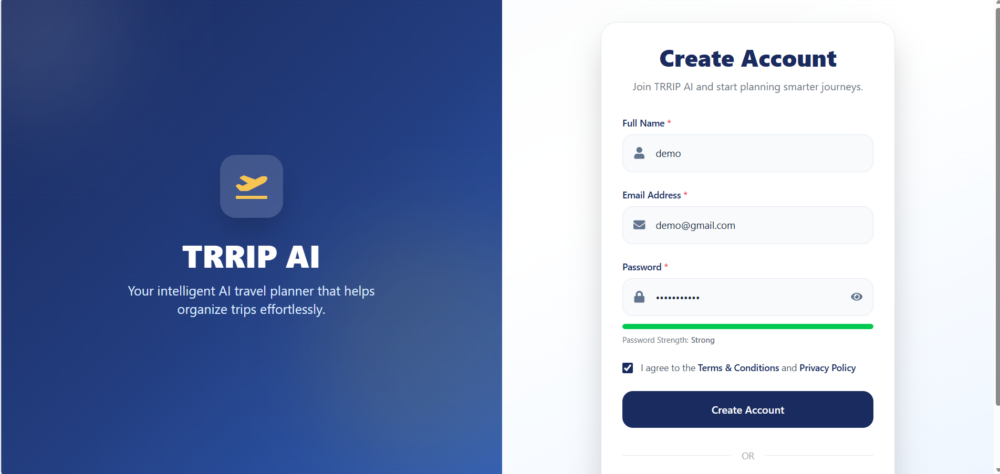
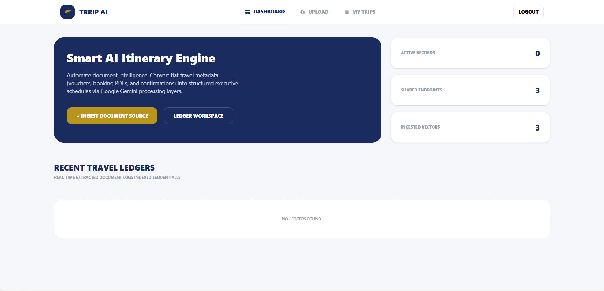
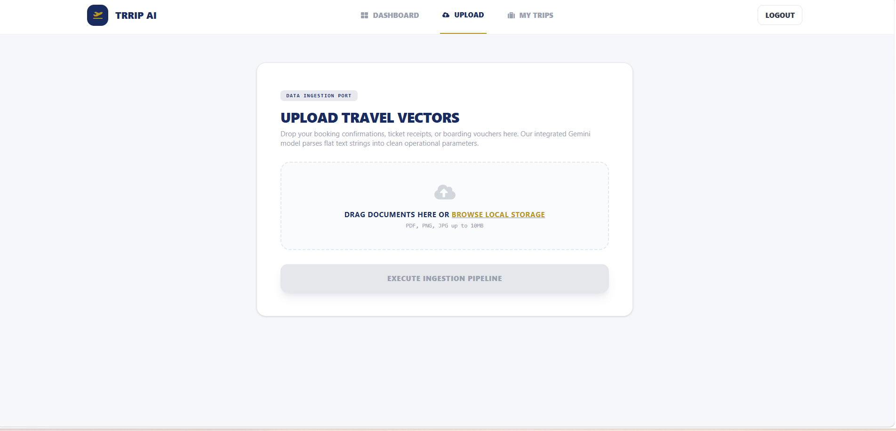
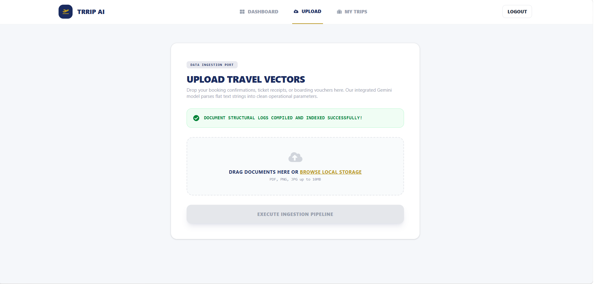
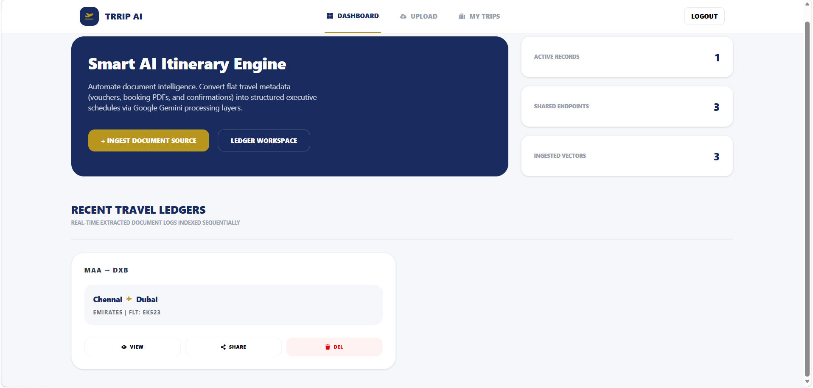
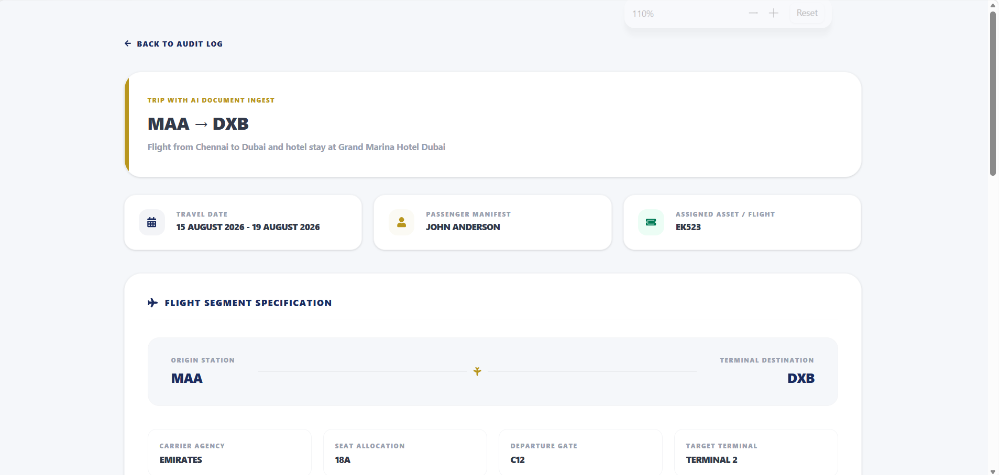
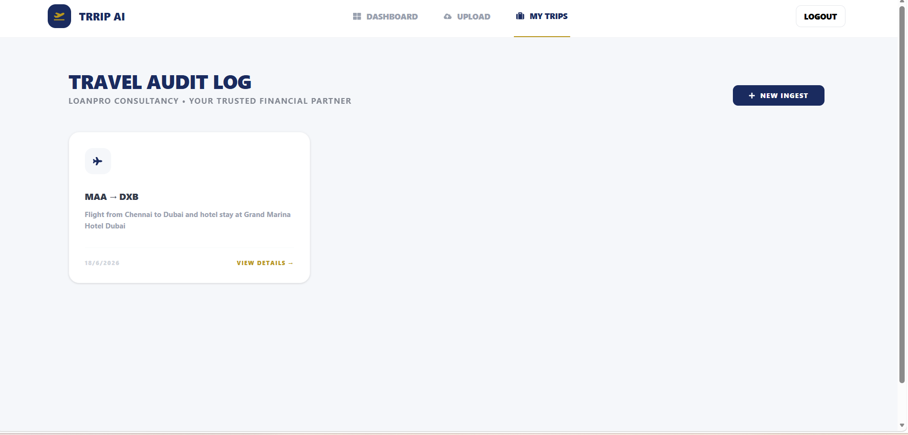

# ✈️ TRRIP AI – Smart Travel Itinerary Generator

<p align="center">


</p>

<p align="center">
AI-powered MERN Stack web application that extracts travel information from uploaded travel documents and automatically generates structured travel itineraries using OCR and AI.
</p>

---

# 🌐 Live Demo

### Frontend
https://trrip-ai-travel-planner.vercel.app

### Backend API
https://trrip-ai-travel-planner.onrender.com

---

# 📖 Project Overview

TRRIP AI is an AI-powered travel itinerary management system developed using the MERN Stack.

The application enables users to upload travel-related documents such as:

- ✈ Flight Tickets
- 🏨 Hotel Booking Confirmations
- 📄 Travel PDFs
- 🖼 Travel Images

Using OCR (Tesseract OCR), PDF parsing, and Groq AI, the application extracts travel information and automatically generates a structured travel itinerary.

Users can securely manage, organize, share, and access their travel plans from a centralized dashboard.

---

# ✨ Features

- 🔐 Secure User Authentication (JWT)
- 👤 User Registration & Login
- 📄 Upload Flight Tickets & Hotel Bookings
- 🖼 OCR Text Extraction (Tesseract OCR)
- 📑 PDF Text Extraction
- 🤖 AI-powered Itinerary Generation
- ✈ Automatic Flight Information Extraction
- 🏨 Hotel Booking Information Extraction
- 📂 Dashboard for Trip Management
- 📋 View Complete Trip Details
- 🔗 Public Shareable Trip Links
- 🗑 Delete Saved Trips
- ☁ Cloudinary File Upload
- 📱 Fully Responsive Design

---

# 🛠 Technology Stack

## 🎨 Frontend

- ⚛ React.js
- ⚡ Vite
- 🎨 Tailwind CSS
- 🌐 Axios
- 🧭 React Router DOM
- 🎯 React Icons

## ⚙ Backend

- 🟢 Node.js
- 🚂 Express.js
- 🍃 MongoDB
- 📦 Mongoose
- 🔐 JWT Authentication
- 📤 Multer
- ☁ Cloudinary
- 🔍 Tesseract OCR
- 📄 pdf-parse
- 🤖 Groq AI API

---

# 🏗 System Architecture

```text
                 React + Tailwind CSS
                         │
                         ▼
                Express.js REST API
                         │
        ┌────────────────┼────────────────┐
        ▼                ▼                ▼
   JWT Authentication  OCR Engine     PDF Parser
                           │               │
                           └──────┬────────┘
                                  ▼
                             Groq AI API
                                  │
                                  ▼
                             MongoDB Atlas
```

---

# 📂 Project Structure

```text
TRRIP-AI
│
├── backend
│   ├── config
│   ├── controllers
│   ├── middleware
│   ├── models
│   ├── routes
│   ├── services
│   ├── utils
│   ├── package.json
│   └── server.js
│
├── frontend
│   ├── public
│   ├── src
│   ├── package.json
│   ├── vite.config.js
│   └── vercel.json
│
├── screenshots
│   ├── register.png
│   ├── dashboard.png
│   ├── upload.png
│   ├── processing.png
│   ├── trip-details.png
│   ├── hotel-details.png
│   └── my-trips.png
│
├── README.md
└── .gitignore
```

---

# 🚀 Installation

## Clone Repository

```bash
git clone https://github.com/Lokesh3177/trrip-ai-travel-planner.git
```

Move into the project.

```bash
cd trrip-ai-travel-planner
```

---

## Backend Setup

```bash
cd backend

npm install

npm run dev
```

---

## Frontend Setup

```bash
cd frontend

npm install

npm run dev
```

---

# ⚙ Environment Variables

## Backend (.env)

```env
PORT=5000

MONGO_URI=

JWT_SECRET=

CLOUDINARY_CLOUD_NAME=
CLOUDINARY_API_KEY=
CLOUDINARY_API_SECRET=

GROQ_API_KEY=
```

---

## Frontend (.env)

```env
# Local Development
VITE_API_URL=http://localhost:5000/api

# Production
VITE_API_URL=https://trrip-ai-travel-planner.onrender.com/api
```

---

# 🔄 Application Workflow

```text
User Registration / Login
            │
            ▼
Upload Travel Documents
            │
            ▼
OCR & PDF Text Extraction
            │
            ▼
Groq AI Processing
            │
            ▼
Generate Structured Travel Itinerary
            │
            ▼
Save Data into MongoDB
            │
            ▼
View • Share • Delete Trips
```

---

# 📸 Application Screenshots

## 📝 Register



---

## 🏠 Dashboard



---

## 📤 Upload Travel Documents



---

## 🤖 AI Processing



---

## ✈ Trip Details



---

## 🏨 Hotel Details



---

## 📚 My Trips



---

# 🌐 API Endpoints

| Method | Endpoint | Description |
|---------|----------|-------------|
| POST | `/api/auth/register` | Register User |
| POST | `/api/auth/login` | Login User |
| POST | `/api/itineraries/upload` | Upload Travel Documents |
| GET | `/api/itineraries` | Get All Trips |
| GET | `/api/itineraries/:id` | Get Trip Details |
| DELETE | `/api/itineraries/:id` | Delete Trip |
| GET | `/api/share/:id` | Get Shared Trip |

---

# 🚀 Future Enhancements

- 📅 Google Calendar Integration
- 📧 Email Itinerary Sharing
- 🌍 Multi-language Support
- 🛂 Passport OCR
- 🛃 Visa Detection
- 🗺 Google Maps Integration
- 📱 Mobile Application
- 🔔 Smart Travel Notifications
- 💳 Travel Expense Tracking

---

# 👨‍💻 Developer

**Lokesh M**

**MERN Stack Developer**

- 💻 GitHub: https://github.com/Lokesh3177
- 💼 LinkedIn: https://www.linkedin.com/in/lokeshm31/

---

# 📝 Project Notes

This project was developed as part of a technical assessment to demonstrate practical full-stack web development skills using the MERN Stack.

The application integrates OCR, PDF parsing, AI-powered information extraction, cloud storage, secure authentication, and MongoDB to automate travel itinerary generation from uploaded travel documents.

---

# 📄 Disclaimer

This project was developed solely for technical assessment and educational purposes. It demonstrates the implementation of a complete MERN Stack application with OCR, AI integration, cloud storage, and responsive user interface design.
````
